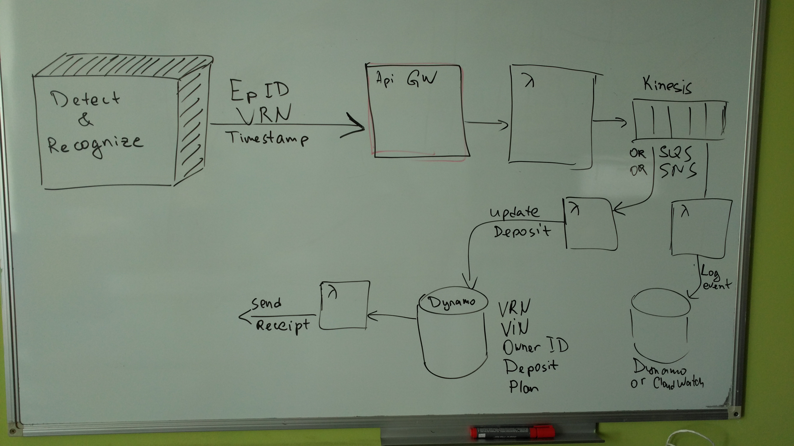

# Setup
## AWS Access
1. `touch $HOME/.aws/credentials`
1. Add the following content to the `$HOME/.aws/credentials`:
    ```
    [default]
    aws_access_key_id=<your_access_key_id>
    aws_secret_access_key=<your_secret_key>
    ``` 

## Gradle Goals
1. Create fat jar:
    ```
    gradle clean jarFat
    ``` 
1. Upload fat jar to s3 and update lambda functions code:
    ```
    gradle deployLambdas
    ```
    
    Default list of lambda functions can be found in the [build.gradle](build.gradle). You may specify list of lambdas explicitly:
    ```
    gradle -PlambdaNames=<lambda_name1>[,<lambda_name2>][,<lambda_name3>] deployLambda
    ``` 

## High Level Architecture
